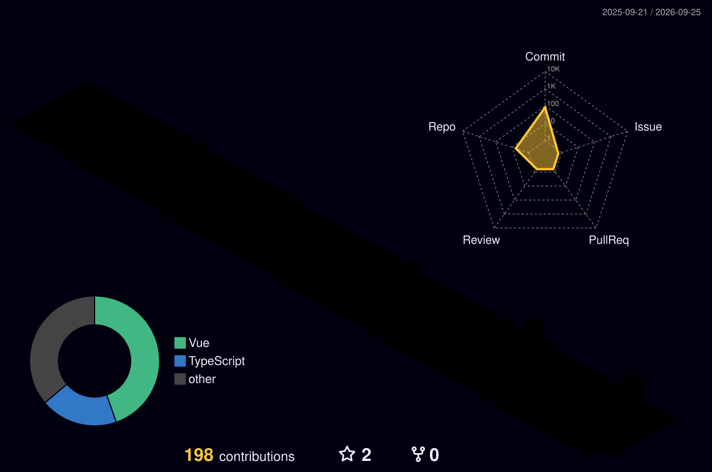

<!-- 动态波浪头部 -->

  

<!-- 动态打字机介绍 -->

  

<!-- 访客计数器与赞助按钮 -->

  
  &nbsp;
  

 

<!-- 100% 稳定的动态数据徽章 -->

  
  &nbsp;
  
  &nbsp;
  
  &nbsp;
  

---

### 🚀 关于我 (About Me)

- 🔭 **当前重心:** 架构设计与全栈开发，同时推进开源模组更新。
- 🌱 **探索领域:** 深入底层系统，拥抱人工智能，紧跟前沿技术栈演进。
- 🎯 **近期目标:** 参与核心开源社区贡献，打造令人惊艳的软件作品。
- 💡 **我的信条:** *"Talk is cheap. Show me the code."*
- 📫 **联系方式:** 欢迎通过 [X (Twitter)](https://x.com/huanleya222019) 找我交流！

---

### 📌 核心项目 (Featured Project)

  

  
<b>✨ 点击展开：查看我的其他趣味项目</b>

   

  *   ☁️ **[cloud-mail](https://github.com/huanleya/cloud-mail)** - 基于 JavaScript 的云端邮件服务探索。
  *   🔧 **[nodejs-huanle](https://github.com/huanleya/nodejs-huanle)** - HTML 与 Node.js 结合的实践项目。
  *   *还有更多有趣的创意正在本地开发中，敬请期待...*

---

### 💻 全栈技术雷达 (Tech Stack)

<table>
<tr>
<td align="center" valign="top" width="50%">
 
<b>💻 编程语言</b>
  

 
</td>
<td align="center" valign="top" width="50%">
 
<b>🌐 前端开发</b>
  

 
</td>
</tr>

<tr>
<td align="center" valign="top">
 
<b>⚙️ 后端框架</b>
  

 
</td>
<td align="center" valign="top">
 
<b>🗄️ 数据库与存储</b>
  

 
</td>
</tr>

<tr>
<td align="center" valign="top">
 
<b>📱 移动跨平台 & 🤖 AI</b>
  

 
</td>
<td align="center" valign="top">
 
<b>🛠️ DevOps & 云服务</b>
  

 
</td>
</tr>

<tr>
<td align="center" valign="top" colspan="2">
 
<b>🎨 工具与设计</b>
  

 
</td>
</tr>
</table>

 

---

### 📊 极客数据分析 (Geek Stats)

  
  

 

  

 

  

---

### 🐍 贡献图贪吃蛇 (Contribution Snake)

  <picture>
    <source media="(prefers-color-scheme: dark)" srcset="https://raw.githubusercontent.com/huanleya/huanleya/output/github-snake-dark.svg" />
    <source media="(prefers-color-scheme: light)" srcset="https://raw.githubusercontent.com/huanleya/huanleya/output/github-snake.svg" />
    
  </picture>

---

### 🏙️ 3D 贡献天际线 (3D Contribution Skyline)

  

---

### 🌐 关注我 (Connect with me)

  
  
  

---

### 🃏 随机编程笑话 (Random Dev Joke)

  

---

### ☕ 每日名言 (Quote of the Day)

  

<!-- 底部渐变收尾 -->

  

